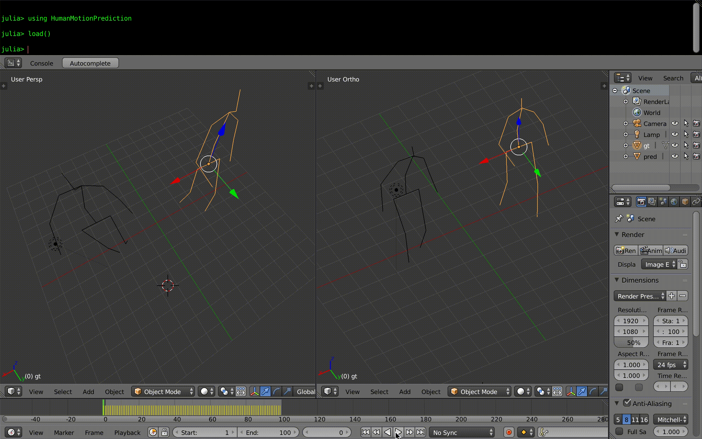

# HumanMotionPrediction

* Load kinematics on Blender for https://github.com/una-dinosauria/human-motion-prediction


# Requirements

* Install https://github.com/wookay/BlenderPlot.jl


# Examples

Run on `Blender Julia Console`

```julia
julia> using HumanMotionPrediction

julia> load()
```



```julia
julia> load("walking_1")

julia> load("eating_0"; sample=Pkg.dir("HumanMotionPrediction", "samples", "eating_1000.h5"))
```
